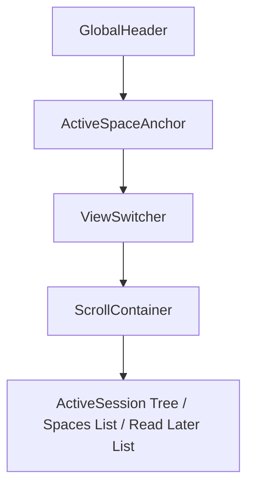

# TabBellus Sleek Developer Minimalist Design Blueprint
*(High-Density / Flat Utility with Rounded Geometry)*

TabBellus is a high-density, flat-utility workspace and tab manager for power users. This document outlines the design system, user interface structure, and visual aesthetics of the TabBellus side panel (sidebar).

---

## 1. Visual & Design Tokens

### Harmony Color Palette
We utilize a clean, high-contrast, flat monochromatic HSL color palette optimized for rendering speed and visual clarity. The theme eliminates all translucent blurs and ambient shadows, relying on solid opaque fills and sharp 1px structural lines, offset with a single Electric Indigo focus accent.

*   **Background (Light Mode):** `hsl(0 0% 100%)` (Pure Solid White)
*   **Background (Dark Mode):** `hsl(0 0% 0%)` (Pure Pitch Black Base)
*   **Card/Surface (Dark Mode):** `hsl(0 0% 3%)` (Solid Flat Matte Charcoal)
*   **Popover/Dialogs (Dark Mode):** `hsl(0 0% 5%)` (Solid High-Contrast Floating Overlay Base)
*   **Foreground / Primary Text:** `hsl(0 0% 98%)` (Pure White text)
*   **Secondary Text:** `hsl(0 0% 63.9%)` (Muted Zinc Silver)
*   **Accent / Focus Color:** `hsl(263.4 70% 50.4%)` (Deep Electric Indigo sole focus accent)
*   **Border / Divider:** `hsl(0 0% 15%)` (Crisp 1px Structural Divider Line)
*   **Hover State (Dark Mode):** `hsl(0 0% 9%)` (Dense Hover Row State)
*   **Group Badges (Chrome colors mapping):**
    *   *Grey:* `hsl(240 5% 40%)`
    *   *Blue:* `hsl(217 91% 60%)`
    *   *Red:* `hsl(0 84% 60%)`
    *   *Yellow:* `hsl(48 96% 53%)`
    *   *Green:* `hsl(142 70% 45%)`
    *   *Pink:* `hsl(330 81% 60%)`
    *   *Purple:* `hsl(270 67% 60%)`
    *   *Cyan:* `hsl(188 86% 53%)`
    *   *Orange:* `hsl(24 95% 53%)`

### Typography
*   **Font Family:** `Inter, Outfit, sans-serif`
*   **Sizing:** 
    *   Header title: `1.125rem` (18px) Semi-Bold
    *   Section title / Active Anchor: `0.875rem` (14px) Medium
    *   Item titles / Tab rows: `0.8125rem` (13px) Regular
    *   Action buttons / Muted info: `0.625rem` (10px, `text-xxs`) font-medium

---

## 2. Layout Structure

The TabBellus sidebar operates in a 360px-400px wide side panel layout with a sticky header and dynamic scroll container.

### A. Global Header (Sticky Top)
*   A flat, opaque header row:
    *   Typographic logo: **TabBellus** in `Outfit` with a vibrant indigo dot.
    *   Search trigger button (`Ctrl+K` shortcut indicator) with solid background and transition.
    *   Action bar containing: "New Tab" shortcut button, "History" icon (with matched space restore), and "Settings" gear.

### B. Active Space Anchor (Context Bar)
*   Identity row that anchors beneath the Global Header if the current window is bound to a Space.
*   Background: Solid high-contrast indigo tint (`bg-primary/10`) with a sharp 1px border.
*   Text: "Linked Space: [Space Name]" with a release button.

### C. View Switcher (Segmented Control)
*   A flat segmented toggle button bar: **[ Active | Saved Spaces | Defer (Read Later) ]**.
*   Smooth, hardware-accelerated HSL slider transitions when active view toggles.

### D. Scroll Container (Dynamic Contents)
1.  **Active View (ActiveSession):**
    *   Flat high-density tree showing active windows, tab groups (collapsible with left-hand 2px solid guide lines), and individual tabs.
    *   **GroupRow:** Rounded header containing the Chrome Group Name with custom HSL badge styling. Hovering reveals "Archive Group" and "Close Group" icons.
    *   **TabRow:** Flat layout row with the website favicon, dynamic title (truncated with custom tooltip trigger), and "Save to Read Later" + "Close" buttons on hover. Supports drag-and-drop handles.
2.  **Saved Spaces View (SpaceList):**
    *   Vertical listing of saved user workspaces.
    *   Each item is a card showing: Space Name, inline edit pencil, timestamp, tab count badge, and a "Restore" button.
    *   Expanded state reveals nested tabs with safe deletion and quick-restore links.
3.  **Read Later View:**
    *   A minimalist inbox queue containing postponed articles or links with 'unread' / 'read' / 'archived' tags.

---

## 3. Visual Constraints & Rendering Performance

*   **No Alpha Blurs or Filters:** Background structures use solid, opaque colors. No `backdrop-filter` or layout transparency overlays are permitted, maximizing scroll rendering performance under memory-constrained Chrome sidebar panels.
*   **Solid Opaque Fields:** Dialog popups and command lists use high-contrast solid backgrounds (`bg-popover` / `hsl(0 0% 5%)`) to float cleanly over background contents without drop shadows.
*   **Sharp 1px Borders:** Spatial separation is established using clean, 1px border lines (`border-border`) rather than ambient glow layers or shadow filters.
*   **GPU-Accelerated Rounded Geometry:** The layout utilizes standard tailwind radius classes (`rounded-md`, `rounded-lg`) mapped to a fixed `--radius: 0.5rem` design token, maintaining smooth geometric contours with zero layout overhead.
*   **Transition Limits:** All micro-interactions use color or opacity transitions (`transition-colors`, `transition-opacity`) instead of costly layout property transitions (`transition-all`), avoiding expensive layout reflow triggers.
