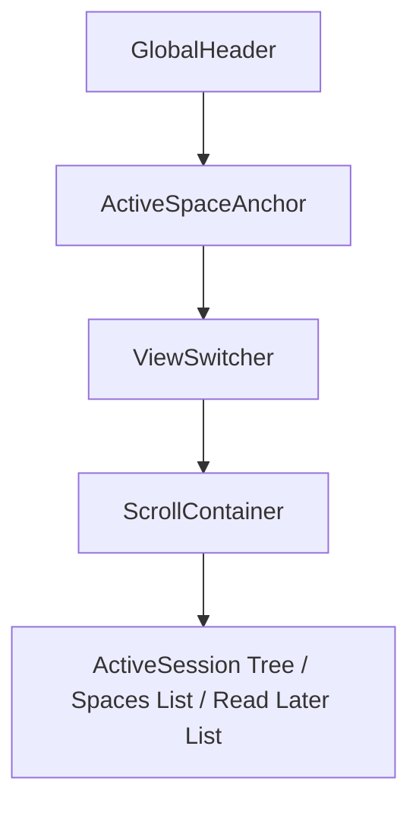

# TabBellus Flat Developer Brutalist / Minimalist Terminal Blueprint

TabBellus is a high-density, flat developer workstation and tab manager for power users. This document outlines the style design system, geometric grid layouts, and visual rules of the TabBellus side panel.

---

## 1. Visual & Design Tokens

### Monochromatic Matrix Color Palette
We utilize a flat, high-contrast HSL color system optimized for speed and structure. All ambient glows, rounded corners, drop shadows, and opacity filters are entirely stripped in favor of sharp, solid colors.

*   **Background (Light Mode):** `hsl(0 0% 100%)` (Pure White)
*   **Background (Dark Mode):** `hsl(0 0% 0%)` (Pure Pitch Black)
*   **Card/Surface (Light Mode):** `hsl(0 0% 98%)`
*   **Card/Surface (Dark Mode):** `hsl(0 0% 3%)` (Flat Dark Charcoal)
*   **Popover / Floating Base (Light Mode):** `hsl(0 0% 100%)`
*   **Popover / Floating Base (Dark Mode):** `hsl(0 0% 5%)` (High Contrast Charcoal Overlay)
*   **Muted / Hover State (Light Mode):** `hsl(0 0% 96.1%)`
*   **Muted / Hover State (Dark Mode):** `hsl(0 0% 9%)` (Dense Row Select hover background)
*   **Border / Divider Line (Light Mode):** `hsl(0 0% 89.8%)`
*   **Border / Divider Line (Dark Mode):** `hsl(0 0% 15%)` (Crisp 1px Steel Grid Divider)
*   **Primary / Focus Accent:** `hsl(263.4 70% 50.4%)` (Sole Electric Indigo Accent)
*   **Group Badges (Chrome colors HSL mapping):**
    *   *Grey:* `hsl(240 5% 40%)`
    *   *Blue:* `hsl(217 91% 60%)`
    *   *Red:* `hsl(0 84% 60%)`
    *   *Yellow:* `hsl(48 96% 53%)`
    *   *Green:* `hsl(142 70% 45%)`
    *   *Pink:* `hsl(330 81% 60%)`
    *   *Purple:* `hsl(270 67% 60%)`
    *   *Cyan:* `hsl(188 86% 53%)`
    *   *Orange:* `hsl(24 95% 53%)`

### Typography & Border Radii
*   **Font Family:** `Inter, Outfit, sans-serif`
*   **Border Radius (`--radius`):** `0px` (Strictly sharp geometric corners everywhere)
*   **Sizing:** 
    *   Header title: `1.125rem` (18px) Semi-Bold
    *   Section title / Active Anchor: `0.875rem` (14px) Medium
    *   Item titles / Tab rows: `0.8125rem` (13px) Regular
    *   Action buttons / Muted info: `0.75rem` (12px) Light/Medium

---

## 2. Layout Structure

The TabBellus sidebar operates in a 360px-400px wide, high-density terminal layout grid with crisp 1px borders.

### A. Global Header (Sticky Top)
*   A flat top bar pane with:
    *   A clean typographic logo: **TabBellus** in `Outfit` with a flat indigo dot indicator.
    *   Search trigger button (`Ctrl+K` shortcut indicator) with solid border, solid background, and color-only hover transitions.
    *   Action control panel: "New Tab" shortcut button, "History" icon (with matched space restore), and "Settings" gear.

### B. Active Space Anchor (Context Bar)
*   Solid high-contrast anchor row immediately below the Global Header if linked to a Space.
*   Background: Solid primary tint background without gradients.
*   Text: "Linked Space: [Space Name]" with a clear release button.

### C. View Switcher (Segmented Control)
*   A flat segment controller: **[ Active | Saved Spaces | Defer (Read Later) ]**.
*   All slider animations are color-only to maximize rapid-rendering performance.

### D. Scroll Container (High Density Contents)
1.  **Active View (ActiveSession):**
    *   High-density list showing active windows, tab groups (collapsible with solid 2px left border color indicators), and individual tabs.
    *   **GroupRow:** Flat header containing the Chrome Group Name badge. Hovering reveals "Archive Group" and "Close Group" buttons.
    *   **TabRow:** Flat row layout with favicon, text (truncated with tooltip), and "Save to Read Later" + "Close" actions.
2.  **Saved Spaces View (SpaceList):**
    *   High-density list of saved workspaces.
    *   Each item is a square card block: Space Name, edit pencil, timestamp, tab count badge, and a "Restore" button.
    *   Expanded state reveals nested tabs with safe deletion and quick-restore links.
3.  **Read Later View:**
    *   A minimalist inbox queue containing postponed articles or links with 'unread' / 'read' / 'archived' tags.

---

## 3. Interaction Mechanics & Style Rules

*   **Sharp Geometry:** Rounding is strictly prohibited (`borderRadius: 0px`). All buttons, cards, list rows, badges, inputs, and dropdown menus are perfectly square.
*   **Solid Transitions:** All hover states use rapid `transition-colors` only. Unnecessary layers, animations, scale shifts (`scale-105`), or blurs are completely omitted.
*   **Pure Monochromatic Base:** Dark mode utilizes absolute pure black (`hsl(0 0% 0%)`) base backgrounds to maximize contrast and efficiency on OLED and developer-oriented displays.
*   **Divider Guidelines:** All structural regions are separated by a crisp 1px border line (`border-border`) using steel/charcoal tones.
