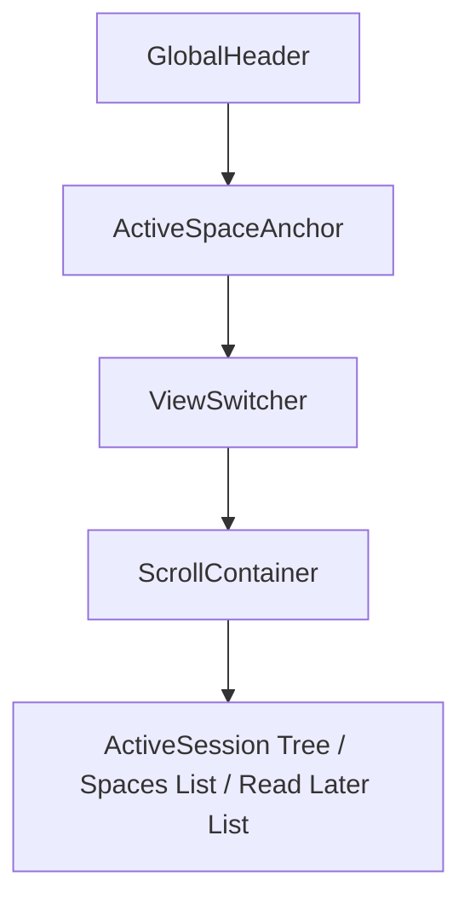

# TabBellus Premium Sidebar Design Blueprint

TabBellus is a premium workspace and tab manager for power users. This document outlines the design system, user interface structure, and visual aesthetics of the TabBellus side panel (sidebar).

## 1. Visual & Design Tokens

### Harmony Color Palette
We utilize a highly curated, premium HSL color palette tailored for absolute visual excellence. The theme is modern glassmorphic, supporting deep dark slate/zinc tones with soft glowing amber and indigo highlights.

*   **Background (Dark Mode):** `hsl(240 10% 3.9%)` (Deep Obsidian)
*   **Card/Surface:** `hsl(240 10% 6%)` (Translucent Slate Glassmorphism, `backdrop-filter: blur(12px)`)
*   **Foreground / Primary Text:** `hsl(0 0% 98%)` (Pure Snow White)
*   **Secondary Text:** `hsl(240 5% 64.9%)` (Muted Zinc Silver)
*   **Accent Color:** `hsl(263.4 70% 50.4%)` (Deep Electric Indigo Accent)
*   **Border / Divider:** `hsl(240 5.9% 15%)` (Muted Steel Guide lines)
*   **Special Interactive Hover:** `hsl(240 5.9% 10%)`
*   **Group Badges (Chrome colors mapping):**
    *   *Grey:* `hsl(240 5% 40%)`
    *   *Blue:* `hsl(217 91% 60%)`
    *   *Red:* `hsl(0 84% 60%)`
    *   *Yellow:* `hsl(48 96% 53%)`
    *   *Green:* `hsl(142 70% 45%)`
    *   *Pink:* `hsl(330 81% 60%)`
    *   *Purple:* `hsl(270 67% 60%)`
    *   *Cyan:* `hsl(188 86% 53%)`
    *   *Orange:* `hsl(24 95% 53%)`

### Typography
*   **Font Family:** `Inter, Outfit, sans-serif`
*   **Sizing:** 
    *   Header title: `1.125rem` (18px) Semi-Bold
    *   Section title / Active Anchor: `0.875rem` (14px) Medium
    *   Item titles / Tab rows: `0.8125rem` (13px) Regular
    *   Action buttons / Muted info: `0.75rem` (12px) Light/Medium

---

## 2. Layout Structure

The TabBellus sidebar operates in a 360px-400px wide side panel layout with a sticky header and dynamic scroll container.

### A. Global Header (Sticky Top)
*   A premium frosted glass top panel with:
    *   A clean typographic logo: **TabBellus** in `Outfit` with a glowing indigo dot.
    *   Search trigger button (`Ctrl+K` placeholder) with glass background and hover transition.
    *   Action bar containing: "New Tab" shortcut button, "History" icon (with matched space restore), and "Settings" gear.

### B. Active Space Anchor (Context Bar)
*   Sliding identity row that anchors beneath the Global Header if the current window is bound to a Space.
*   Background: Soft gradient (`from-indigo-900/30 to-purple-900/20`) with a subtle active indicator glowing animation.
*   Text: "Linked Space: [Space Name]" with a dynamic release button.

### C. View Switcher (Segmented Control)
*   A high-end sliding segment button: **[ Active | Saved Spaces | Defer (Read Later) ]**.
*   Smooth HSL slider micro-animations whenever the user switches tabs.

### D. Scroll Container (Dynamic Contents)
1.  **Active View (ActiveSession):**
    *   Tree list showing active windows, tab groups (collapsible with left-hand color guide-lines), and individual tabs.
    *   **GroupRow:** Rounded header containing the Chrome Group Name with custom HSL badge styling. Hovering reveals "Archive Group" and "Close Group" icons.
    *   **TabRow:** Glass-like row with the website favicon, dynamic title (truncated with custom tooltip trigger), and "Save to Read Later" + "Close" buttons on hover. Supports drag-and-drop handles.
2.  **Saved Spaces View (SpaceList):**
    *   Vertical listing of saved user workspaces.
    *   Each item is a card showing: Space Name, inline edit pencil, timestamp, tab count badge, and a "Restore" button.
    *   Expanded state reveals nested tabs with safe deletion and quick-restore links.
3.  **Read Later View:**
    *   A minimalist inbox queue containing postponed articles or links with 'unread' / 'read' / 'archived' tags.

---

## 3. Interaction Mechanics & Micro-animations

*   **Drag & Drop Feedbacks:** Hovering over droppable regions reveals a soft dash border with dynamic spacing expansion (`transition-all duration-200`).
*   **Scale Hover Effects:** Icons and interactive items expand slightly on focus/hover (`scale-105`) with a transition ease.
*   **Glassmorphic Overlays:** Dialog popups use deep background blur (`backdrop-blur-md`) and scale up from center with standard shadcn animation parameters.
