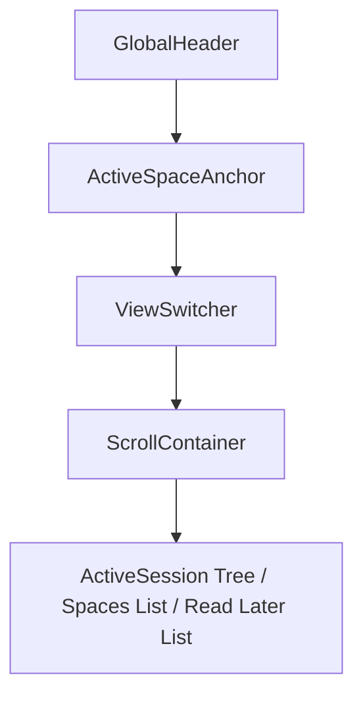

# TabBellus Sleek Developer Minimalist Design Blueprint
*(High-Density / Flat Utility with Rounded Geometry)*

TabBellus is a high-density, flat-utility workspace and tab manager for power users. This document outlines the design system, user interface structure, and visual aesthetics of the TabBellus side panel (sidebar).

---

## 1. Visual & Design Tokens

### Harmony Color Palette
A clean, high-contrast, flat monochromatic palette optimized for rendering speed and visual clarity. No translucent blurs or ambient shadows: solid opaque fills, sharp 1px structural lines, and a single monochrome focus accent.

> **Source of truth for values:** CSS variables in `src/index.css` (`:root` = light, `.dark` = dark), exposed as Tailwind colors in `tailwind.config.ts`. This document defines each token's *role*. If a value here and the code ever disagree, the code wins; update this document.

| Role | Token / class | Intent |
| :--- | :--- | :--- |
| App background | `--background` / `bg-background` | Pure white (light); pure pitch-black OLED base (dark) |
| Cards & surfaces | `--card` / `bg-card` | Flat matte surface, one step off the background |
| Popovers & dialogs | `--popover` / `bg-popover` | Solid, high-contrast floating overlay base |
| Primary text | `--foreground` / `text-foreground` | Maximum-contrast text |
| Secondary text | `--muted-foreground` / `text-muted-foreground` | Muted zinc-silver metadata text |
| Focus / active accent | `--primary` / `bg-primary`, `--ring` | The sole accent: near-black (light) / near-white (dark) |
| Hover & dense row state | `--muted`, `--accent` / `bg-muted`, `bg-accent` | Dense hover rows and subtle fills |
| Structural lines | `--border` / `border-border` | Crisp 1px dividers only |
| Destructive | `--destructive` / `bg-destructive` | Delete / irreversible actions |

**Tab group colors (Chrome color mapping):** defined in `src/lib/colors.ts` (`GROUP_COLORS`) using Tailwind's `*-500` palette for badges, text, and guide lines, with `/10` (light) and `/20` (dark) tints for row backgrounds. Always resolve via `getGroupColorClasses()`; never hardcode group colors.

### Structural vs. Interactive Token Separation Matrix
Interactive control surfaces (switch tracks, checkbox boxes, slider rails, radio groups, menu controls) are strictly decoupled from structural layout tokens (`--input`, `--border`, `--background`, `--muted`) to prevent contrast collapse on pitch-black OLED dark cards (`--card`) or pure white light themes (`--background`). Radix/shadcn UI primitives in `src/components/ui/` own explicit high-contrast utility classes directly in JSX; the primitives are the source of truth for exact classes, including hover and disabled variants:

*   **Structural CSS Variables (Layouts & Containers):**
    *   `--background`, `--card`, `--popover`, `--border` are reserved strictly for layout containers, cards, dialogs, popovers, and 1px structural dividing lines.
*   **Authoritative Interactive Palette (Control Affordances):**
    *   **Unchecked Tracks/Rails:** `bg-zinc-300` (Light) / `dark:bg-zinc-700` (Dark) ensuring WCAG AA `≥ 3.0:1` contrast against card surfaces (`--card` / `bg-card`).
    *   **Tactile Thumbs/Indicators:** `bg-white` (Light) / `dark:bg-zinc-100` (Dark unchecked) / `dark:bg-black` (Dark checked against white primary fill) with `shadow-sm ring-1 ring-black/10 dark:ring-white/10` ensuring clear physical depth and affordance.
    *   **Active Fills:** `bg-primary` (near-black light / near-white dark) for maximum visual contrast on active state transitions.
    *   **Focus Rings:** `focus-visible:ring-1 focus-visible:ring-ring focus-visible:ring-offset-1 focus-visible:ring-offset-background` preserving accessible keyboard navigation.

### Typography
*   **Font Family:** `Inter, Outfit, sans-serif`
*   **Sizing:** 
    *   Header title: `1.125rem` (18px) Semi-Bold
    *   Section title / Active Anchor: `0.875rem` (14px) Medium
    *   Item titles / Tab rows: `0.8125rem` (13px) Regular
    *   Action buttons / Muted info: `0.625rem` (10px, `text-xxs`) font-medium

---

## 2. Layout Structure

The TabBellus sidebar operates in a 360px-400px wide side panel layout with a sticky header and dynamic scroll container.

```mermaid
graph TD
    A[GlobalHeader] --> B[ActiveSpaceAnchor]
    B --> C[ViewSwitcher]
    C --> D[ScrollContainer]
    D --> E[ActiveSession Tree / Spaces List / Read Later List]
```

### A. Global Header (Sticky Top)
*   A flat, opaque header row:
    *   Typographic logo: **TabBellus** in `Outfit` with a vibrant monochrome dot.
    *   Search trigger button (`Ctrl+K` shortcut indicator) with solid background and transition.
    *   Action bar containing: "New Tab" shortcut button, "History" icon (with matched space restore), and "Settings" gear.

### B. Active Space Anchor (Context Bar)
*   Identity row that anchors beneath the Global Header if the current window is bound to a Space.
*   Background: Solid high-contrast background (`bg-muted`) with a sharp 1px border.
*   Text: "Linked Space: [Space Name]" with a release button.

### C. View Switcher (Segmented Control)
*   A flat segmented toggle button bar: **[ Active | Saved Spaces | Defer (Read Later) ]**.
*   Smooth, hardware-accelerated HSL slider transitions when active view toggles.

### D. Scroll Container (Dynamic Contents)
1.  **Active View (ActiveSession):**
    *   Flat high-density tree showing active windows, tab groups (collapsible with left-hand 2px solid guide lines), and individual tabs.
    *   **GroupRow:** Rounded header containing the Chrome Group Name with custom HSL badge styling. Hovering reveals "Archive Group" and "Close Group" icons.
    *   **TabRow:** Flat layout row with the website favicon, dynamic title (truncated with custom tooltip trigger), and "Save to Read Later" + "Close" buttons on hover. Supports drag-and-drop handles.
2.  **Saved Spaces View (SpaceList):**
    *   Vertical listing of saved user workspaces.
    *   Each item is a card showing: Space Name, inline edit pencil, timestamp, tab count badge, and a "Restore" button.
    *   Expanded state reveals nested tabs with safe deletion and quick-restore links.
3.  **Read Later View:**
    *   A minimalist inbox queue containing postponed articles or links with 'unread' / 'read' / 'archived' tags.

---

## 3. Visual Constraints & Rendering Performance

*   **No Alpha Blurs or Filters:** Background structures use solid, opaque colors. No `backdrop-filter` or layout transparency overlays are permitted, maximizing scroll rendering performance under memory-constrained Chrome sidebar panels.
*   **Solid Opaque Fields:** Dialog popups and command lists use high-contrast solid backgrounds (`bg-popover`) to float cleanly over background contents without drop shadows.
*   **Sharp 1px Borders:** Spatial separation is established using clean, 1px border lines (`border-border`) rather than ambient glow layers or shadow filters.
*   **GPU-Accelerated Rounded Geometry:** The layout utilizes standard tailwind radius classes (`rounded-md`, `rounded-lg`) mapped to a fixed `--radius: 0.5rem` design token, maintaining smooth geometric contours with zero layout overhead.
*   **Transition Limits:** All micro-interactions use color or opacity transitions (`transition-colors`, `transition-opacity`) instead of costly layout property transitions (`transition-all`), avoiding expensive layout reflow triggers.